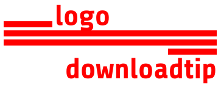

# Logo Downloadtip

[](https://github.com/tiagoporto/logo-downloadtip/releases)
[](https://www.npmjs.com/package/logo-downloadtip)
[](https://packagephobia.com/result?p=logo-downloadtip)

<!-- [](https://travis-ci.com/tiagoporto/logo-downloadtip)
[](https://coveralls.io/github/tiagoporto/logo-downloadtip)
[](https://stryker-mutator.github.io) -->

Webcomponent to allow users download multiple logotype image types when they trying to grab low resolution logo.

> The original ideia for this project was by [Nicklas Jarnesjö](https://github.com/jarnesjo/jquery-logo-downloadtip), the idea is amazing I’ve create a modern version.

## 🧰 Stack


<!--  -->


<!--  -->


![Browserslist](https://img.shields.io/badge/Browserslist-%23FED538.svg?style=for-the-badge&color=%23FFD539&logo=data:image/svg+xml;base64,PHN2ZyB4bWxucz0iaHR0cDovL3d3dy53My5vcmcvMjAwMC9zdmciIHZpZXdCb3g9IjAgMCAzMC4xIDMyIj48cGF0aCBkPSJNMjIuNCAxMS41Yy0uMS0uMy0uNC0uNi0uNy0uOC4yLjQgMCAuOC0uMyAxLS4zLjEtLjcgMC0uOS0uNS0uMS0uMyAwLS41IDAtLjdoLS4zYy0uOC4zLTEuMiAxLjMtLjkgMi4xLjMuOCAxLjMgMS4yIDIuMS44czEuMi0xLjMuOS0yLjFaIi8+PHBhdGggZD0iTTE5LjQgMTkuMmMzLjEtLjUgNi4xLTEuNiA4LjgtMy4xaC4xYzEuMS0uOSAyLjItMi41LjctMy4zLS43LS40LTEuNCAwLTEuOS40LTIuNS0xLTQuMy0zLjEtNC44LTUuNiAyLjEtLjkgNC41LTEgNi42LS4zLTIuOS0zLjEtNi4zLTMuOC04LjQtMy44LjItLjcuOC0xIDEuNy0xLjktMi43LS42LTYuMSAxLjEtNy4yIDIuMi0uNC0uNS0xLTIuMy0xLTMuMy0xLjQuNC0yLjkgMy4yLTMuMSA0LjQtLjctLjQtMS43LTEuOC0yLjEtMi43LTEgLjgtMS43IDMuNy0xLjYgNS4zLTEuMS0uNC0yLjEtMS4xLTIuOS0yLS43IDIuMi0uMiAzLjcuNSA1LjMtLjguMi0yLjYtLjItMy40LS42LS4zIDIuMiAxLjMgNCAyLjMgNC42LS44LjQtMi4zLjUtMy41LjYuNSAxLjggMi41IDIuOSAzLjggMy42LTEgMS0yIDEuNi0yLjkgMi4xIDEuMyAxLjIgMyAxLjkgNC44IDIuMS0uNC43LTEuMiAyLjMtMS44IDMuMSAxLjIuMyA0LjMgMCA0LjgtLjItLjMgMS41LS41IDIuOSAwIDQgMS0uNSAzLjItMS44IDMuOS0yLjMgMCAxLjYuOCAzLjEgMi4yIDMuOS4yLTEuMSAxLjMtMyAxLjktMy40LjQuNyAyLjIgMi43IDMuNSAyLjcgMC0xLjIuMi0zIC42LTMuNiAxLjEuNyAzLjIgMS42IDQuOS45LS44LS43LTEuNy0yLjQtMS42LTMuMiAyLjYtLjUgNC4yLTIgNC42LTMuOC0yLjcgMS4zLTcuMS44LTkuNS0yLjFabTcuMy01LjNzLjIgMCAuMy4xYy41LjMuNi44LjQgMS4zIDAgLjItLjIuNC0uNS41LTIuNiAxLjUtNS40IDIuMi04LjEgMi42LS43LTEuMS0xLjEtMi42LTEuMS00LjQgMC0yLjggMS42LTQuOSAzLjctNi4xLjcgMi43IDIuNiA0LjkgNS4yIDZaIi8+PC9zdmc+)

<!--  -->


## Installation 📦

```bash
npm i logo-downloadtip
```

## Usage ➡️

```html
<html>
  <head>
    <link
      rel="icon"
      type="image/svg"
      href="./img/logo.svg"
      data-title="Vector file (.svg)"
    />
  </head>

  <logo-downloadtip>
    
  </logo-downloadtip>

  <script type="module" src="./logo-downloadtip.js"></script>
</html>
```

### Options

```html
<logo-downloadtip title="Tolltip Title" position="top|bottom|right|left">
</logo-downloadtip>
```

## Development 🛠

### Pre-requirements

- [git](https://git-scm.com)
- [nvm](https://github.com/nvm-sh/nvm)

### Install node

```bash
nvm install
```

### Install pnpm

```bash
corepack enable pnpm
```

### Install dependencies

```bash
pnpm install
```

### Install

```bash
pnpm install
```

## License 📄

This project is licensed under the [MIT License](LICENSE).
